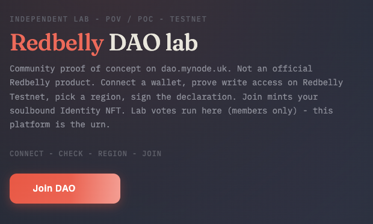

# Lab DAO

[![Redbelly Testnet](https://img.shields.io/badge/Redbelly-Testnet-c41e3a?logo=data%3Aimage%2Fsvg%2Bxml%3Bbase64%2CPHN2ZyB4bWxucz0iaHR0cDovL3d3dy53My5vcmcvMjAwMC9zdmciIHZpZXdCb3g9IjAgMCA1MDAgNTUwIj48cGF0aCBmaWxsPSIjZmZmIiBkPSJNNDYyLjI1LDE0NS41NiwyNTYuMDcsMjYuNjNhMTIuMTMsMTIuMTMsMCwwLDAtMTIuMTQsMEwzNy43NSwxNDUuNTZhMTIuMTUsMTIuMTUsMCwwLDAtNi4wNywxMC41MVYzOTMuOTRhMTIuMTYsMTIuMTYsMCwwLDAsNi4wNywxMC41MUwyNDMuOTMsNTIzLjM4YTEyLjE4LDEyLjE4LDAsMCwwLDEyLjE0LDBMNDYyLjI1LDQwNC40NWExMi4xNiwxMi4xNiwwLDAsMCw2LjA3LTEwLjUxVjE1Ni4wN0ExMi4xNSwxMi4xNSwwLDAsMCw0NjIuMjUsMTQ1LjU2Wk0yNTAsNTEuMTVsMTkwLjYzLDExMGMtMzEuMDUsMTcuNTItNTcuMjUsMzkuNzctNzkuMzUsNjQuNTctNDMuMTItNTAuODQtMTAzLTEwMS0xODQuMzgtMTMyLjM3Wk00MDQuMzUsMzA4LjkxYTEzLjcsMTMuNywwLDAsMS0xMi41NS04LjIxLDEzLjU4LDEzLjU4LDAsMSwxLDI1LjA5LDBBMTMuNjksMTMuNjksMCwwLDEsNDA0LjM1LDMwOC45MVptMC00MC43M2EyNy4yMywyNy4yMywwLDAsMC05LjU0LDEuOGMtNy43Ny0xMS40Ny0xNi4xOC0yMy4xNC0yNS43LTM0LjkyYTMwMi4zNiwzMDIuMzYsMCwwLDEsNzAuNDctNTkuMjksNjYxLjI5LDY2MS4yOSwwLDAsMC0zNC4yNyw5Mi41MUM0MDUsMjY4LjI3LDQwNC42OCwyNjguMTgsNDA0LjM1LDI2OC4xOFpNMzUzLjI4LDIzNWMtMjEuOSwyNi4zNi0zOS40Nyw1NS4xOS01My41Niw4NC02LjgxLTk4LjczLTgyLjctMTc2LjA2LTEyMy40My0yMTNDMjU0LjM3LDEzNi45NCwzMTEuODQsMTg1LjczLDM1My4yOCwyMzVabS02MiwxMjdhMTMuNywxMy43LDAsMCwxLTEyLjU1LTguMjEsMTMuNDQsMTMuNDQsMCwwLDEtMS01LjEyLDEzLjYyLDEzLjYyLDAsMSwxLDEzLjU3LDEzLjMzWm0tMy43NC00MC4zNWEyNy40NywyNy40NywwLDAsMC02LjgxLDEuNzQsNDgwLjk0LDQ4MC45NCwwLDAsMC0xMDEuNzQtMTAyLjQsMjcsMjcsMCwwLDAsMy43Ni0xMy42MiwyNy4zOCwyNy4zOCwwLDAsMC0yMS4zOS0yNi42OFYxMDguOUMxOTguNzcsMTQyLjA2LDI4MS4zOSwyMjAuOTIsMjg3LjQ5LDMyMS41N1pNMTY3LjgzLDIxMi40MWExMy43LDEzLjcsMCwwLDEtMjUuMSwwLDEzLjM5LDEzLjM5LDAsMCwxLTEtNS4xMSwxMy41NywxMy41NywwLDAsMSwyNy4xNCwwQTEzLjM5LDEzLjM5LDAsMCwxLDE2Ny44MywyMTIuNDFabS0xOC42Ny0xMDMuMXY3MS4zM2EyNy4zMiwyNy4zMiwwLDAsMC0xNiwxMC41NEE0NDMuMjcsNDQzLjI3LDAsMCwwLDYzLDE1OVpNNTYsMTgwLjUzYzE4LjEyLDI2Ljg0LDUzLjczLDg0LjEzLDc1LjMxLDE0OC4yNS0uMjQuMTUtLjUxLjI3LS43NC40M0E0NTIuNiw0NTIuNiwwLDAsMCw1NiwyNzYuNjlaTTE1OS41NiwzNTEuNzhhMTMuNDQsMTMuNDQsMCwwLDEtMSw1LjEyLDEzLjUyLDEzLjUyLDAsMSwxLDEtNS4xMlptLTExLDg4LjU0TDU2LDM4Ni45M1YyOTAuNjdhNDM1LjEzLDQzNS4xMywwLDAsMSw2Ni4yNCw0Ny43MUEyNy4wOSwyNy4wOSwwLDAsMCwxNDQuMzIsMzc5QzE0OC4xNiwzOTkuNjIsMTUwLDQyMC4yOSwxNDguNTMsNDQwLjMyWk0xNjAuMTYsNDQ3YzIuNC0yMi45Mi43MS00Ni41Ni0zLjU1LTcwYTI3LDI3LDAsMCwwLDMuNzEtMiw1MTkuNTIsNTE5LjUyLDAsMCwxLDgyLDExOS40MVptODguNzcsMzMuNTdhNTMwLjg4LDUzMC44OCwwLDAsMC04MC0xMTMuODlBMjcuMzUsMjcuMzUsMCwwLDAsMTQ2LDMyNC4zOGEyNy44OCwyNy44OCwwLDAsMC0zLjA1LjMxQzEyMC43MywyNTguMzQsODQsMTk5Ljg3LDY1LjU0LDE3Mi44NGE0MzIuMSw0MzIuMSwwLDAsMSw2Mi44MiwyOS40OSwyNy44OSwyNy44OSwwLDAsMC0uNSw1LDI3LjQsMjcuNCwwLDAsMCw0Mi45MSwyMi41OUE0NjcuOSw0NjcuOSwwLDAsMSwyNzAuODgsMzMwLjM5YTI3LjA4LDI3LjA4LDAsMCwwLDYuNjEsNDEuNzhBNjQwLjE2LDY0MC4xNiwwLDAsMCwyNDguOTMsNDgwLjZabTEwLjIxLDEzYTYyNC42Nyw2MjQuNjcsMCwwLDEsMjkuNzktMTE3LjgzYy43Ny4wNywxLjUxLjIzLDIuMy4yM2EyNy4wNywyNy4wNywwLDAsMCw4LjcxLTEuNTRBNTIzLjcxLDUyMy43MSwwLDAsMSwzMzYuNDEsNDQ5YW04Ny45MS01MC43MWE1MzcuMiw1MzcuMiwwLDAsMC0zNi43NS03NC42NUEyNy4xNCwyNy4xNCwwLDAsMCwzMDksMzI3Ljg1YzEzLjY4LTI4LjU5LDMwLjY4LTU3LjIzLDUyLjE2LTgzLjQsOC42NiwxMC44MiwxNi40LDIxLjU0LDIzLjU3LDMyLjA5YTI3LjIzLDI3LjIzLDAsMCwwLDcuOSw0My42OSw1MzkuNjUsNTM5LjY1LDAsMCwwLTEwLjg0LDEwMi42M1pNMzk0LDQxNS43OUE1MzAuMzQsNTMwLjM0LDAsMCwxLDQwNC40OSwzMjNhMjcuMDgsMjcuMDgsMCwwLDAsNy43OC0xLjI4LDUwMy4xNSw1MDMuMTUsMCwwLDEsMzAuMzMsNjYuMDhabTUwLTU3Yy01LjM4LTEyLjM4LTExLjUxLTI3LjExLTIxLjI0LTQzLjFBMjcuMTQsMjcuMTQsMCwwLDAsNDE3LDI3MS4zOSw2NTMuMzIsNjUzLjMyLDAsMCwxLDQ0NCwxOTUuNTVaIiAvPjwvc3ZnPg%3D%3D&logoWidth=36&style=plastic)](https://redbelly.network/)
[](https://dao.mynode.uk)
[](https://dao.mynode.uk)
[](https://dao.mynode.uk/how)
[](https://react.dev/)
[](https://www.typescriptlang.org/)
[](#status)
[](LICENSE)

**An independent membership · proposal office · voting urn on [Redbelly](https://redbelly.network/) Testnet.**

Live (lab): **[dao.mynode.uk](https://dao.mynode.uk)**

> This repository is a **public overview** of the product · what it is and how to use it.  
> Application source code, operators tooling, and deployment configs stay in a private repository.

> **Not** the official Redbelly DAO. **Not** affiliated with, operated by, or endorsed by Redbelly Network.



---

## What it is

Lab DAO puts three things under one roof that many DAOs split across wallets, Discord, and Snapshot:

| Layer | What you get |
|-------|----------------|
| **Door** | Wallet on Redbelly Testnet → CAT (write access) → signed Join → soulbound **Identity** |
| **Office** | Draft a packet, submit to High Council; checklist flags are a coaching signal, not a locked door |
| **Urn** | Lab vote here: signed ballots off-chain, **result** on-chain - not a public "who voted how" roll by default |

Guests can read the register and docs. **They cannot draft or vote** until Join.

---

## What's on the site

| Area | What you get |
|------|----------------|
| **Join / Profile** | Membership, link wallets, optional Discord, XP prestige |
| **Proposals** | Register, draft desk, HC coaching thread, discussion, lab vote |
| **How** | Clickable map for members and High Council (no PIN) |
| **Resources** | Living constitution / checklist PDFs and contract addresses |
| **Archive** | Closed lab votes (+ optional Snapshot.org history, read-only) |

Step-by-step map: **[dao.mynode.uk/how](https://dao.mynode.uk/how)**

---

## How it works (high level)

```text
Guest  →  Join (Identity)  →  member
member → draft → HC queue → public discussion → urn
member → signed ballot  →  result on-chain
```

- **One Identity = one ballot.** Link extra wallets on Profile instead of a second Join.
- **Hard flags** travel with the packet for HC coaching; they do not block submit to the queue.
- **Hybrid urn:** ballots stay on the platform; Finalize may publish tallies on-chain without a voter roll.
- High Council can tighten a vote with tenure, XP gate, Discord gate, and allowlist.

No infrastructure hostnames, secrets, or operator runbooks are published here.

More detail: [`docs/overview.md`](docs/overview.md) · full community narrative: [`docs/OVERVIEW-LIGHT.md`](docs/OVERVIEW-LIGHT.md) ([PDF](docs/overview-light-en-reading-edition.pdf))

---

## Status

- **Product:** lab · POV / POC on Redbelly Testnet · features may change  
- **Source:** private  
- **This repo:** documentation / product overview only  

---

## Related

- Network: [redbelly.network](https://redbelly.network/)
- Live lab: [dao.mynode.uk](https://dao.mynode.uk)
- How map: [dao.mynode.uk/how](https://dao.mynode.uk/how)

---

## Contact

Open to collaboration - feedback, partnerships, integrations, or joint experiments around the lab path. Questions, bug reports, or ideas welcome.

[](https://discord.com/channels/969088176322908160/1378117350619873311)